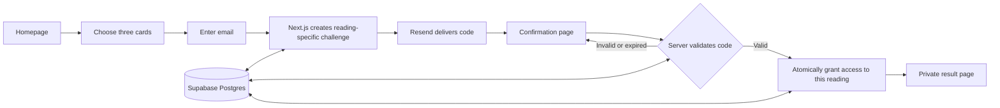

Tarotova (proposed name) — v1 product, engineering, and launch plan

Prepared and reviewed 13 September 2026; revised same day after a second review pass. Status: proposed implementation; no application or external services have been created. Tarotova is the recommended working name, replacing Quiet Arcana. A live registry lookup found no registration for `tarotova.com`; registrar checkout and a brand-conflict check remain necessary before purchase. See [DOMAIN-RESEARCH.md](./DOMAIN-RESEARCH.md) for evidence, alternatives, and prices. See section 14 for what changed in this revision and why.

All local project files, generated assets, caches, temporary files, and project tooling configuration must remain under `/Users/abhishekshori/dev/288b8f92d9/`. Do not inspect other local directories. Any future tool that requires access elsewhere must be identified before use.

**1. Product decision.** Build a free, English-language, mobile-first tarot experience with one journey: start on the homepage, choose three cards, enter an email, confirm an emailed code on a dedicated page, and read the result. Every new reading requires its own confirmation. Refreshing an already verified reading in the same browser does not require another code while its access remains valid.

Use the complete 78-card Rider–Waite–Smith (RWS) structure, upright only, in a Situation / Challenge / Guidance spread. The original Major Arcana-only proposal was a narrower reading variation; the full deck better satisfies the requested traditional foundation. Offer General, Relationships, Work, and Personal Growth as an optional focus, with General selected initially. A visitor can think of a question privately; the app does not need to collect personal free-text questions to deliver v1.

**Scope contingency.** Release criteria (section 9) require complete 78-card artwork and a documented RWS practitioner review, and neither an illustrator nor a reviewing practitioner has been identified or budgeted yet (section 8's hosting estimates explicitly exclude commissioned art and review fees). If either supplier is not sourced and on track by the end of the "Deck and reading experience" milestone (section 10), fall back to shipping a 22-card Major Arcana v1 first — same architecture, spread, and verification design — with the remaining 56 Minor Arcana cards following as v1.1, rather than slipping the whole launch on an unbooked supplier.

**Tarot methodology.** The research did not identify a single governing international standard for divinatory tarot readings. Established traditions and association-specific ethics exist; the app must name its chosen method rather than claim international certification or predictive accuracy. RWS is the selected tradition, documented in [A. E. Waite's original text](https://en.wikisource.org/wiki/The_Pictorial_Key_to_the_Tarot) and the publisher's [78-card RWS deck](https://www.usgamesinc.com/tarot-and-inspiration/all-products/Rider-Waite-Smith).

| Convention | Required implementation |
| --- | --- |
| Deck composition | 22 Major Arcana and 56 Minor Arcana; all 78 participate in every shuffle |
| Minor suits | Wands, Cups, Swords, Pentacles; Ace–Ten plus Page, Knight, Queen, King in each suit |
| Major numbering | Fool 0, Strength VIII, Justice XI, World XXI; consistent RWS names and order |
| Draw | Uniform shuffle, selection without replacement, three distinct cards, and fixed selection order |
| Positions | Situation, Challenge, Guidance, explained before drawing; this is our chosen three-card spread, not an internationally mandated spread |
| Reversals | Explicit upright-only practice in v1; orientation is stored as `upright`. Reversed readings are a separate optional practice, not a requirement for a legitimate reading |
| Interpretation | Preserve each card's symbolism, then interpret it in its position and in relation to the other cards |
| Quality review | Source notes, editorial checks across all cards, and review by an experienced RWS practitioner before public release; do not claim endorsement that has not been obtained |

The publisher describes the [22-plus-four-suits structure](https://www.usgamesinc.com/files/attachments/1446/TST78_Booklet.pdf); Waite explicitly documents the [Strength/Justice numbering choice](https://en.wikisource.org/wiki/Page:The_Pictorial_Key_to_the_Tarot.pdf/113). Llewellyn treats [whether to use reversals](https://www.llewellyn.com/blog/2013/12/what-are-tarot-reversals/) as a reading-method choice. Keep RWS conventions consistent instead of mixing in Marseille numbering or Thoth court titles. Readings should support the visitor's agency, respect confidentiality, and discuss relationships from the visitor's perspective. These editorial principles are informed by [TABI's ethics](https://tabi.org.uk/ethics/), without claiming TABI membership, endorsement, or complete adoption of its membership code.

The visual ritual of choosing cards is useful inspiration from [EvaTarot](https://www.evatarot.net/). Its homepage uses ten selections and the Major Arcana; our three-card flow reduces the interaction required before verification. Llewellyn's supplied page returned HTTP 403 when opened, so this plan does not claim a complete visual review of it. Its indexed [reading page](https://www.llewellyn.com/tarot_reading.php?Deck=9&Layout=1Conten) provides additional context. All copy, artwork, and layout for this app will be original.

**2. Visual direction.** Tarotova should feel like a calm, contemporary illustrated journal. Use warm ivory (`#F6F1E8`) for the page, deep plum (`#30253B`) for text and primary actions, muted bronze (`#9B7849`) for decorative details, and restrained sage (`#66745E`) for success accents. Validate each actual text/background pairing for contrast; decorative bronze is not the default small-text color.

Use a self-hosted editorial serif for headings, such as Fraunces, and Inter for body copy, controls, and code entry. Keep body text at least 16px, reading paragraphs around 65 characters wide, and interactive targets at least 44px. Use a consistent spacing scale, clear focus outlines, visible labels, and one primary action per screen.

Create 78 coherent SVG illustrations plus one card back, with a shared frame, line weight, limited palette, and recognizable RWS symbolism. Minor Arcana artwork must retain meaningful scenes and suit/rank distinctions; generic decorative icons alone are insufficient. Author original vector assets and keep a font and asset provenance record; current commercial deck reproductions are not automatically reusable. Desktop can use a decorative fan in the hero. The selectable deck uses three pages of 26 face-down slots from the same fixed 78-card shuffle, with a responsive grid and clear previous/next controls. On narrow phones, show four columns with a persistent three-slot selection tray that does not obscure content. Changing pages never redraws or reshuffles; choices persist across all three pages.

Animation is limited to a short shuffle, movement into a selected slot, and the reveal after verification. Use CSS transforms and opacity; no animation library is needed initially. Respect reduced-motion preferences, keep content usable without animation, and avoid artificial countdowns or delays.

**3. Screens and navigation.** A small brand header and footer are sufficient. Footer links cover privacy, terms, and a working support contact; there is no account dashboard or content-heavy navigation in v1.

| Route | Experience | Main action |
| --- | --- | --- |
| `/` | Headline, a short explanation, focus chips, and an honest email disclosure | Choose my cards |
| `/reading/[id]/choose` | Face-down deck, shuffle before selecting, ordered selection tray, “2 of 3 selected” feedback | Continue with these cards |
| `/reading/[id]/email` | Three selected card backs, email field, explanation of the verification requirement | Send my code |
| `/reading/[id]/confirm` | Masked email, code input, resend timer, change-email link, and inline status | Confirm and reveal |
| `/reading/[id]/result` | Card reveal, short combined interpretation, three readable card explanations, one reflection prompt | Begin another reading |
| `/privacy`, `/terms` | Concise supporting policies and deletion/support instructions | Return to reading |

Homepage disclosure: “Free three-card reading. You'll confirm your email before your cards and interpretation are revealed.” Email-screen copy: “We'll email you a one-time code to reveal this reading. This does not subscribe you to marketing.”

Allow changes to selected slots before Continue. Persist each editable selection on the server with a revision number so a refresh restores acknowledged choices and out-of-order requests cannot overwrite newer state. Show a saving/retry state for unacknowledged changes. Continue explicitly locks the three choices and focus; identical retries are safe. Shuffling is allowed only while no cards are selected, unless the visitor first clears the editable selection. Returning from email or confirmation must preserve the locked draw. Changing the email invalidates the existing code without changing the cards. The confirmation page uses one accessible text input styled as six cells, supports paste and `autocomplete="one-time-code"`, and preserves leading zeros.

Build loading, empty, expired, invalid-code, attempt-limit, delayed-email, offline, and unavailable-service states as part of the initial screens. A failed email attempt never silently restarts the reading. After a refresh, the server restores progress from the browser session; local storage is not proof of verification.

**4. Reading content and draw engine.** Use a small, deterministic TypeScript interpretation engine with versioned editorial content. Each of the 78 cards has its canonical ID, name, arcana, suit/rank where applicable, upright orientation, artwork, source notes, keywords, core meaning, three position-specific interpretations, and focus-specific guidance. Focus-specific guidance is one short blurb per focus per card, not a separate variant of each position interpretation — a card's content is its core meaning, three position interpretations, and four focus blurbs (16 pieces of text), not a 3×4 cross product per card. Separate traditional symbolic meaning from our modern reflective wording. A Challenge position calls for an upright card's difficulty or tension in that context; it must not silently switch to a reversed definition. A rule-based summary connects the three cards through editorial themes without guaranteeing predictions. Store the result snapshot, deck version, spread version, and content version when the draw is locked so later edits do not change an existing reading.

Aim for a 60–90 word combined overview, 70–110 words per position interpretation (three per card), 20–40 words per focus blurb (four per card), and one useful reflection question per reading. That puts total interpretive content at roughly 30,000–35,000 words across all 78 cards; budget the editorial-writing and practitioner-review milestone against that number, not against a per-card figure alone. Review difficult cards such as Death, The Devil, and The Tower with care: explain symbolism without threatening predictions. Frame the experience as reflection and entertainment. Describe how readings are assembled honestly; v1 does not need a runtime AI service or per-reading generation charges.

The server creates a uniform Fisher–Yates shuffle of all 78 unique card IDs using cryptographically generated unbiased indices and stores its private slot-to-card mapping. The browser receives opaque slot identifiers and card backs. At locking, it submits exactly three distinct valid slots in selection order; the server resolves their identities. All 78 cards have equal opportunity to be drawn, irrespective of the selected topic or visible deck page. Do not weight cards by email, topic, engagement, or a desired interpretation, and do not redraw difficult cards. Neither chosen card names nor their interpretation, image paths, mapping, or random seed are sent before confirmation, including in page HTML, React payloads, prefetch responses, or analytics. Public artwork may be public; the association between a visitor's draw and specific artwork stays private.

**5. Application architecture.** Use a single Next.js application and managed Postgres, with small modules for readings, verification, email delivery, and persistence. This is sufficient for v1 and keeps deployment and debugging straightforward.

| Layer | Choice | Purpose |
| --- | --- | --- |
| Web app and backend | Next.js App Router, React, TypeScript | Server-rendered pages, interactive card selection, and same-origin API routes |
| Styling | Tailwind CSS, CSS variables, native accessible controls | Consistent visual tokens with a small dependency footprint |
| Validation | Zod | Shared request and content schemas, enforced again on the server |
| Database | Supabase-hosted Postgres | Durable readings, verified emails, challenges, and abuse counters |
| Database access | Drizzle and postgres.js | Typed queries, SQL migrations, and explicit transactions |
| Email delivery | Resend API with a React Email template and plain-text alternative | Transactional delivery of verification codes |
| Verification | Reading-specific Next.js service using Node cryptography | Code creation, validation, attempt limits, and access grants |
| Bot protection | Cloudflare Turnstile and database-backed limits | Protect the public email endpoint and free sending quota |
| Tests | Vitest, React Testing Library, Playwright, axe | Domain rules, interaction, real-browser flows, and accessibility |
| Deployment | Vercel, with preview builds and separate environment secrets | Native Next.js hosting and straightforward rollback |

Follow the current stable [Next.js setup](https://nextjs.org/docs/app/getting-started/installation), pin dependencies and a compatible supported Node version, and commit the lockfile. Use Server Components by default, with client components for the deck, focus choice, and forms. The Node runtime handles database and cryptography work. Supabase documents [Drizzle integration](https://supabase.com/docs/guides/database/drizzle); use its transaction pooler for serverless requests, a small connection cap, and compatible prepared-statement settings. Use a separate migration credential and connection.

Supabase supplies the database in this design; it is not the OTP provider. A narrow reading-specific challenge avoids treating a persistent account login as permission to reveal every subsequent reading. Resend supplies delivery through its [email API](https://resend.com/docs/api-reference/emails/send-email). This does mean we own the verification code's correctness, which is why its concurrency and abuse tests are release requirements.

**6. OTP and result access.** Generate a uniformly random six-digit code using Node's cryptographic random generator. Give it a ten-minute lifetime and permit five failed attempts per challenge. Store a keyed HMAC of the code and its challenge context, using a secret held outside the database. Do not store raw codes in the application database or logs. Include the reading ID, challenge ID, generation, and intended email in the context; compare fixed-length digests in constant time.

The email field accepts any address a visitor types, including one they do not own. The operational risk this creates is not just send-volume cost: repeated unsolicited codes to addresses that bounce or complain damage the reputation of a newly verified sending domain, which can get legitimate codes foldered for everyone. Turnstile and the per-email/per-IP budgets below bound the volume; the suppression list (section 7) stops further sends to addresses that have already bounced or complained.

Before sending, validate the browser's reading ownership, request origin, input, bot token, rate budget, and that the address is not on the suppression list. Create the challenge and reserve the send budget atomically. Use one provider idempotency key per challenge generation to prevent duplicate delivery during bounded retries, following [Resend's idempotency guidance](https://resend.com/docs/dashboard/emails/idempotency-keys). Await delivery submission within the request; do not rely on unfinished work after a serverless response. A timeout means acceptance is uncertain, not that email definitely failed. Preserve a usable pending code in that case; on a definite rejection, mark delivery failed and offer a controlled retry.

At verification, lock the current challenge and reading in a database transaction. Check ownership, current generation, expiry, send status, and attempt budgets; consume a valid challenge, upsert the verified email record, and mark that reading verified in the same transaction. Failed attempts must commit their counters before returning an error; throwing and rolling back the counter would defeat the limit. Concurrent requests cannot double-consume a code. If the success response is lost, a repeat request from the same browser returns the already-granted result without granting any additional access. A resend or email change supersedes the previous challenge without resetting the rolling abuse budgets. All competing mutations use a consistent database lock order. Late delivery responses and webhooks may update only their own challenge generation and cannot reactivate a superseded code.

Use a random 256-bit browser session token in a `Secure`, `HttpOnly`, `SameSite=Lax`, host-only cookie, storing only its hash in Postgres. Bind each reading to that session. Result access requires a matching session, verification for that exact reading, and an unexpired access grant. Knowing the result URL, modifying React state, presenting another reading's code, or having a previously verified email is insufficient.

| Control | Initial application policy |
| --- | --- |
| Code expiry | 10 minutes |
| Wrong codes | 5 per challenge; additional rolling email/IP budgets across new challenges |
| Resend cooldown | 60 seconds, enforced using server time |
| Sends to one email | 3 per hour and 5 per day initially |
| Sends from one IP | 10 per hour initially; monitor shared-network false positives |
| Draw creation | Per-session and per-IP limits before allocating database rows |
| Global sends | Reserve headroom below provider daily/monthly caps; deny new sends gracefully when exhausted |
| Sending domain health | Monitor bounce and complaint rate via provider webhooks; pause new sends automatically if either crosses a defined threshold, independent of the volume caps above |
| Suppressed addresses | Blocked from receiving new codes indefinitely once hard-bounced or complained; checked before every send |
| Result access | Up to 30 days in the original browser; a new draw always requires its own code |

These are tunable application defaults, not Resend defaults. Use atomic Postgres counters rather than process-local memory so limits work across deployments and concurrent instances. Hash abuse identifiers with a keyed digest, expire them promptly, and trust only hosting-provided client-IP metadata. Validate Turnstile tokens on the server; its [Free plan](https://developers.cloudflare.com/turnstile/plans/) is suitable for the initial integration.

Keep generic verification errors and redact sensitive request bodies. All mutations enforce same-origin/CSRF protection. Code expiry, limited attempts, and single-use handling follow the principles in [OWASP's token guidance](https://cheatsheetseries.owasp.org/cheatsheets/Forgot_Password_Cheat_Sheet.html). That reference informs the design; it is not a claim of an external security audit.

**7. Data, APIs, and privacy.** Application tables live in a private database schema, with no direct browser access. Revoke public/anonymous grants; give the runtime database role only the needed privileges and keep schema changes on a separate credential. If any table is later exposed through Supabase's Data API, add and test row-level security before exposure. The application's ownership checks remain required for every private query.

| Record | Essential fields |
| --- | --- |
| `browser_sessions` | ID, token hash, creation and expiry times |
| `readings` | Opaque public ID, browser-session ID, state/revision, focus, private 78-card mapping, editable/locked slots, resolved card IDs/orientations, deck/spread/content versions, result snapshot, verified-email ID, draft/access expiry and verification timestamps |
| `verified_emails` | ID, validated email, normalized lookup value, verification timestamp, last activity |
| `email_challenges` | ID, reading ID, intended email, code HMAC and key version, generation, attempts, expiry, consumed/superseded state, provider message ID and send status |
| `rate_limit_buckets` | Keyed identifier digest, action/window, count, expiry |
| `delivery_events` | Deduplicated provider event ID, message ID, delivery/bounce status, timestamp; no message body |
| `suppressed_emails` | Normalized lookup value (hashed), reason (hard bounce/complaint), first-suppressed timestamp, source event ID; retained on its own clock, independent of `delivery_events` |

Use foreign keys, unique constraints, allowed-state checks, and indexes for session ownership and expiry cleanup. Normalize email conservatively; do not strip dots or plus tags or merge addresses across providers. A successful confirmation proves receipt of that code, not a person's legal identity or consent to receive newsletters.

| API | Contract |
| --- | --- |
| `POST /api/readings` | Create an owned draft and private shuffle; return ID and safe slot metadata |
| `POST /api/readings/[id]/shuffle` | Replace the shuffle only while the editable selection is empty; enforce expected revision |
| `PUT /api/readings/[id]/selection` | Save 0–3 editable slots with expected revision, or explicitly lock exactly three distinct slots and focus; identical retries are safe |
| `GET /api/readings/[id]/status` | Return safe progress only, including masked email and retry time where relevant |
| `POST /api/readings/[id]/otp` | Send, resend, or change email with explicit intent, bot protection, and idempotency |
| `POST /api/readings/[id]/verify` | Consume the current code and grant this reading's access |
| `GET /api/readings/[id]/result` | Return the result only after full server authorization |
| `POST /api/webhooks/email` | Verify provider signature and deduplicate delivery/bounce events |

Page rendering and API handlers share the same authorization service. Validate body size and schema; return structured errors and `Retry-After` for throttling. Keep all private responses `Cache-Control: private, no-store`, exclude private routes from the sitemap, add `noindex`, and prevent sensitive URL/referrer data from reaching third parties. An API redirect alone is not the security boundary.

Initial retention: abandoned readings and their unverified addresses expire 24 hours after draft creation; verified reading access expires 30 days after that reading's verification. A later reading does not extend an older reading. Keep a verified email record only while at least one unexpired verified reading needs it. A ten-minute OTP expiry never extends the draft's lifetime. Remove consumed or expired challenge digests at the next cleanup; delete expired sessions and rate buckets. Retain minimal delivery metadata for seven days. Suppressed-address records are an exception to that seven-day window: keep them on their own, longer clock (for example, two years, or until the address owner requests removal), since deleting a bounce/complaint record on the same schedule as `delivery_events` would silently re-enable sending to a known-bad address. Run an authenticated scheduled cleanup hourly, while every access check enforces expiry immediately. Live database deletion is due within one hour of each expiry; monitor missed jobs and describe this window accurately in the privacy notice. Distinguish live deletion from provider and backup retention.

The privacy notice explains these purposes, processors, necessary session cookie, retention, and a deletion contact. Maintain a verified deletion procedure covering live records and documenting backup/provider retention. Store email for verification and reading continuity only; do not create a marketing audience. Configure analytics and logs to exclude emails, codes, browser tokens, private reading IDs, and request bodies.

**8. Email setup and actual costs.** Resend's current free transactional tier includes 3,000 emails per month and a 100-email daily cap. Its Pro tier is $20/month for 50,000 emails with no daily cap. Resends and unsuccessful verification journeys still consume sending capacity. With an illustrative 1.2 sends per attempt, the free daily cap supports about 83 attempts before additional safety headroom; operate a beta closer to 60–70 attempts/day. These are planning calculations, not guaranteed throughput. See [Resend pricing](https://resend.com/pricing).

Sending publicly requires a domain we control, verified with the provider; a hosting subdomain is insufficient for this step. Configure SPF, DKIM, and DMARC, use a transactional subdomain, turn off open/click tracking, and test real delivery to Gmail, Outlook, and another provider. Resend explains its [verified-domain requirement](https://resend.com/docs/dashboard/domains/introduction). Generating a code locally does not replace the email delivery service.

Warm the domain with a gradual, capped send-volume ramp before opening the public beta rather than starting at full traffic on day one. A freshly verified subdomain with correct SPF/DKIM/DMARC can still be foldered by receiving providers until it has built sending history, so deliverability — not quota — is the real early constraint (see section 12).

Supabase Free currently includes 500 MB of database storage and can pause after a week of inactivity. Supabase Pro starts at $25/month and includes daily backups; it is the intended database tier for a dependable public launch. See [Supabase pricing](https://supabase.com/pricing).

Vercel Pro currently starts at $20/month with one deploying seat and included usage credit. Vercel Hobby is restricted to personal, noncommercial use, so a business launch must not assume eligibility merely because visitors do not pay. See [Vercel Pro](https://vercel.com/docs/plans/pro-plan) and its [fair-use rules](https://vercel.com/docs/limits/fair-use-guidelines).

| Stage | Hosting + database + email base estimate |
| --- | --- |
| Eligible personal prototype | $0/month on free tiers, subject to terms and caps |
| Limited public/business beta | $20/month: Vercel Pro + Supabase Free + Resend Free |
| Recommended dependable small launch | $45/month: Vercel Pro + Supabase Pro + Resend Free |
| Launch with more email capacity | $65/month: Vercel Pro + Supabase Pro + Resend Pro |

Prices checked 13 September 2026; estimates exclude domain renewal/registration, tax, extra environments, optional services, and usage overages. The app remains free to visitors in every scenario. No paid service or domain has been purchased. Set explicit budget alerts and sending caps before launch; upgrade before a campaign if projected email volume exceeds headroom.

**9. Verification and release criteria.** Test behavior and security properties, with real Postgres for transactional integration tests. Use mocked email delivery for most automated tests, plus a staging test that sends and verifies a real code. Test fixtures and test-only mail capture must never become a production bypass.

| Layer | Required coverage |
| --- | --- |
| Domain/unit | Exactly 78 unique cards with 22/56 composition, four 14-card suits, correct RWS numbering/court ranks, valid distinct draws, page-independent slot ordering, content resolution for all 78 cards/three positions/four focuses, upright-only behavior, stable result versions, OTP expiry/leading zeros, digest context binding |
| Database/API integration | Wrong owner denied, unverified read denied, draft revision conflicts, immutable locked focus/draw, only one active generation, single-use code, concurrent verification/resend/email-change races, committed failed-attempt counts, quota increments under contention, transaction rollback, and independent expiry/deletion deadlines |
| Browser | Complete journey, paste/autofill, reload/back navigation, change email, expired/wrong code, resend cooldown, provider timeout, exhausted quota, and restarting a reading |
| Leakage checks | Inspect HTML, React streaming data, network responses, and prefetches for pre-verification result disclosure; inspect logs for sensitive fields |
| Accessibility | Keyboard-only selection, screen-reader labels and announcements, focus movement, zoom, reduced motion, contrast, and axe checks |
| Performance | Mobile production build, optimized artwork/fonts, stable layout, database query timing, and load tests around send/verify concurrency |

Run lint, TypeScript checks, content validation, unit/integration tests, and a production build in CI; run Playwright against the built application. The [Next.js testing guides](https://nextjs.org/docs/app/guides/testing) cover the chosen unit and browser tools. Aim for 90+ Lighthouse scores on representative public pages and Core Web Vitals of LCP ≤2.5s, INP ≤200ms, and CLS ≤0.1 at the 75th percentile once field data exists. These are targets to measure, not claims about an unbuilt app.

Release requires: no known verification bypass, no result leakage before confirmation, dependable retries without changing cards, complete 78-card editorial/artwork coverage, an experienced RWS practitioner's documented content review, usable phone and keyboard flows, real email delivery tests, a tested cleanup job, correct provider limits/secrets, and a rollback procedure. If the 78-card artwork/review scope in this list is not achievable on the section 10 timeline, section 1's scope contingency applies: the same release list, but for a 22-card Major Arcana release instead. Sample complete three-card readings to assess coherence as well as individual definitions. Record reviewer corrections and outstanding issues rather than treating automated tests as proof of tarot expertise. Before the dependable launch, test a database restore into a separate environment.

**10. Build sequence and deliverables.** Budget roughly 20–30 focused working days for a production-ready v1 with 78 original illustrations and reviewed interpretations. The earlier 10–15 day estimate applied to the smaller 22-card scope and is superseded. This is an estimate; DNS/provider verification, artwork production, and availability of a practitioner for editorial review can change elapsed time and cost. Hosting estimates in section 8 do not include commissioned art or external review fees.

| Milestone | Concrete deliverable | Approximate effort |
| --- | --- | --- |
| Foundation and design | Next.js scaffold, visual tokens, responsive screen layouts, three sample cards, schemas, and initial migrations | 2 days |
| Deck and reading experience | All 78 cards, reviewed interpretation content, paginated selection, server draw engine, and result layout | 10–14 days |
| Verification and persistence | Database roles, browser ownership, OTP endpoints, email template, confirmation page, limits, and private result gate | 2–3 days |
| Quality and operations | Automated flow/security tests, practitioner review, accessibility/performance fixes, failure states, cleanup, delivery events, and CI | 4–6 days |
| Staging and release | Domain/email configuration, real inbox checks, restore/rollback rehearsal, small beta, and launch assets | 2–5 days |

The handoff includes application source, 78 original cards and a card back, versioned interpretations and their source/review notes, SQL migrations, tests, email templates, `.env.example` without secrets, setup/deployment instructions, privacy/terms drafts, and an operating runbook. Proposed code folders are `src/app`, `src/components`, `src/features/readings`, `src/features/verification`, `src/server`, `src/content`, `public/cards`, `drizzle`, `emails`, `tests`, and `docs`, all under the authorized workspace.

**11. Distribution and launch.** Use Git-based delivery: pull request checks, isolated preview deployments, a staging database and email configuration, then a tagged production release. Production credentials must never reach preview builds. Coordinate application and schema changes using backward-compatible migrations; application rollback alone cannot undo an incompatible database migration.

Start with a small usability beta and watch completion, email arrival, resend frequency, and support reports. Fix the largest drop-off or reliability issue before broad promotion. Prepare a homepage title/description, canonical URL, social preview image, favicon, sitemap, and a short original explanation of the reading on the homepage. Index the public experience only; private readings must never become SEO pages.

Prepare a small set of branded social images and a brief demo for launch. Community posts and outreach can bring initial visitors once the product is ready, followed by search optimization informed by actual usage. Publishing posts or sending outreach is a separate external action. An email submitted for a reading is not permission for launch marketing.

Track aggregate steps: started, selection completed, code requested, provider accepted/delivered, verification succeeded, and result rendered. Report completion and resend rates, email delivery latency, API failures, and quota usage without including email addresses or reading text in analytics. Delivery acceptance and inbox delivery are different events; use provider events and actual inbox tests together.

**12. Scaling without a rewrite.** Initially, cache the homepage and public assets at the CDN while running private operations in one region near the database. Keep state in Postgres, use pooled connections, and index ownership/expiry lookups. The first expected constraint is sender reputation and deliverability on a newly verified sending domain, not email quota or interpretation generation; quota only becomes the binding constraint once deliverability is established.

At sustained usage, upgrade email before exceeding daily or monthly headroom. Use Supabase Pro for backups and continuous operation; monitor database storage, connection pressure, and query latency rather than relying on a speculative user-count threshold. Set hosting spend alerts and verify that a sending-quota outage cannot reveal unverified results. Monitor bounce and complaint rate against provider-recommended thresholds on an ongoing basis, and treat a rising rate as a launch/traffic blocker on the same footing as a quota outage.

If measured bursts exceed synchronous sending capacity, add a durable delivery queue/outbox with deduplicated jobs, bounded retries, encrypted short-lived payloads, and expiry-aware sending. Never send an expired code from a backlog. At larger request volumes, move abuse counters to a managed Redis service if Postgres contention justifies it. Keep the same verification contract and transactional access grant.

Load-test the next expected peak before a major campaign. Consider more database compute or replicas only after query/index improvements and connection management. Add a second email provider only if observed delivery or availability needs justify the operational work. Public assets can be global immediately; private writes should remain near their single database until there is evidence for a more complex deployment.

**13. Inputs needed at launch.** No product or framework questions block this plan. The working defaults are original branding, English, a global audience, three cards from the complete 78-card RWS deck, upright-only readings, free use, and no marketing subscription. `tarotova.com` is the preferred eight-character .com candidate; see [DOMAIN-RESEARCH.md](./DOMAIN-RESEARCH.md). Launch will require the domain to be registered to its owner, deployment/database/email accounts, secrets entered through the deployment environment, an actual support address, and operator details for the policies. Two inputs are currently unsourced and would block the 78-card release list above: an illustrator for the 78 original SVGs and an experienced RWS practitioner for the documented content review. Source both before or during the "Deck and reading experience" milestone, or invoke section 1's 22-card scope contingency. Provider regions and policies should match the operator and intended audience before public release. These can be supplied when wiring the tested app to live services; credentials should not be pasted into public source or committed files.

**14. Revision history.** This is the second pass of the plan, revised same-day (13 September 2026) after an internal review of the first version. Changes from v1:

- **Content-volume contradiction fixed (sections 4, 9).** v1's test requirement ("content resolution for all 78 cards/three positions/four focuses") read as a 78×3×4 cross product, which contradicted the 70–110-word-per-card budget by roughly 4x. Clarified that focus guidance is four short standalone blurbs per card, not a per-position variant, and added an explicit total content budget (~30,000–35,000 words across all 78 cards) so the editorial milestone can be scoped against a real number.
- **Bounce suppression added (sections 6, 7).** v1 recorded bounces in `delivery_events` but deleted that table after seven days, with no check before sending — meaning a hard-bounced address could be re-emailed indefinitely. Added a `suppressed_emails` table on its own, longer retention clock, checked before every send.
- **Unsolicited-send abuse named (section 6).** v1 bounded send volume (Turnstile, per-email/IP limits) but never named the underlying threat: a visitor can type in an address they don't own, and the real cost is complaint/bounce damage to a brand-new sending domain, not just abuse volume. Made that explicit and added a sending-domain-health control (monitor bounce/complaint rate, pause sends on threshold breach) alongside the existing volume caps.
- **Deliverability corrected as the first scaling constraint (sections 8, 12).** v1 stated email quota would be the first capacity constraint. For a freshly verified sending domain with no history, deliverability/sender reputation is the more likely first wall. Added a pre-launch warmup ramp and ongoing bounce/complaint monitoring, treated as a launch blocker on the same footing as a quota outage.
- **Scope contingency added (sections 1, 9, 13).** v1 made complete 78-card artwork and a practitioner review hard release gates without an illustrator or practitioner identified or budgeted. Flagged both as unsourced blocking inputs and added a fallback: ship a 22-card Major Arcana v1 first on the same architecture if either supplier isn't on track by the relevant milestone, with the full 78-card deck following as v1.1.
