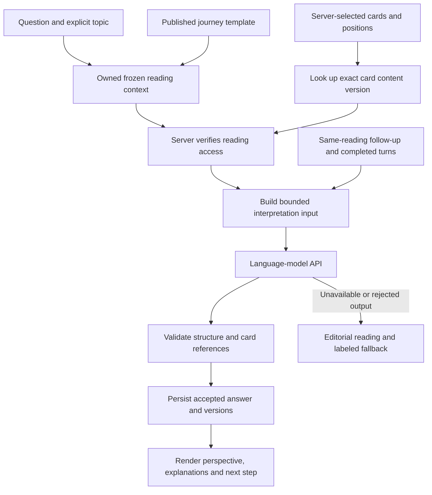

# Question companion and guided journeys — experience and data design

14 September 2026. Implementation specification supporting
[PLAN-EXTENDED.md](./PLAN-EXTENDED.md). Everything below is proposed unless
explicitly listed as existing. [ACCESS-FLOW.md](./ACCESS-FLOW.md) adds the later
first-reading-without-email / second-reading continuation policy. This document
makes the selected question
companion and guided journeys concrete; the deferred journal, alternative
spreads and card-learning library are not dependencies.

## 1. What the journey looks like

Worked example: **Navigating a change**, with the question “What should I
consider before changing jobs?” The three product stages are **Frame your
question → Explore your cards → Choose a next step**. Card selection and the
continuation verification apply according to eligibility: the first draw needs
no email; an unverified visitor beginning a subsequent draw verifies before
card selection, then proceeds directly on later draws while verification lasts.

| Screen | What the person sees | Main action | Where its data comes from |
| --- | --- | --- | --- |
| Journey chooser | Three illustrated tiles: Navigating a change, Preparing for a conversation, Reopening creativity; each has a purpose and three-stage preview | Explore a journey | Published journey templates and original artwork |
| Journey introduction | Large title, short invitation, stage outline, self-paced explanation and first-reading/continuation verification disclosure | Begin this journey | The selected template's frozen version |
| Frame your question | An editable starter, optional topic context, a short prompt and a 500-character question field | Choose my cards | Template prompt plus the user's text; never an inferred personal history |
| Continue with email (subsequent draw only) | Email form then code input before selection; intended question/journey stays visible; omitted for a first draw or valid verified session | Confirm and continue | Proposed session continuation challenge and verification state |
| Choose cards | Compact question summary, face-down deck, three numbered tray positions and immediate save feedback | Reveal these cards | Owned server shuffle and acknowledged selection; no chosen identities sent yet |
| Explore | Three revealed cards, a combined perspective answering the question, position explanations, contextual follow-up suggestions | Ask a follow-up or Continue | Authorized card content plus a stored, validated contextual interpretation |
| Choose a next step | One relevant small-action suggestion, an optional reflection prompt and a quiet completion action | Finish this journey | The already-stored interpretation's next step plus the template's closing prompt |
| Completion | A concise closing message and the takeaway; return to this reading while access lasts | Return home | Published closing copy and the existing reading; no new generation |

The question companion uses the same Frame/eligibility/Choose/Explore experience,
entered directly from the homepage without a journey introduction. It offers
follow-ups and a takeaway without requiring a three-stage journey.

### Low-fidelity phone layout: explore stage

This is a structural wireframe, not finished visual artwork. Apply the extended
plan's midnight/plum stage, warm gold accents and lighter reading surfaces.

```text
┌───────────────────────────────────┐
│ ‹ Back       Tarotova              │
│ Navigating a change                │
│ Frame ━━━ Explore ─── Next step    │
│                                   │
│ Your question                     │
│ What should I consider before     │
│ changing jobs?                     │
│                                   │
│  [Fool]    [Chariot]    [Hermit]    │
│ Situation  Challenge   Guidance    │
│                                   │
│ Your perspective                  │
│ Consider a small experiment that  │
│ makes the change more concrete…   │
│                                   │
│ Situation · The Fool              │
│ [larger art + readable explanation]│
│ Challenge · The Chariot           │
│ [larger art + readable explanation]│
│ Guidance · The Hermit             │
│ [larger art + readable explanation]│
│                                   │
│ Explore this reading              │
│ [What could I try this week?]      │
│ [What should I reflect on first?]  │
│ Ask a follow-up…                  │
│ [Send]       3 follow-ups available│
│                                   │
│ [Continue to a next step]          │
└───────────────────────────────────┘
```

The sample cards and wording are illustrative, never a prescribed draw. On a
phone this is a scrolling page, not content compressed into one viewport.
Keep a compact spread summary near the answer; the input and action remain
reachable with the keyboard open. On tablets/desktop, use two columns: spread
and question on the left, readable interpretation and follow-ups on the right.
Stage progress stays visible without covering the text. Use the existing
responsive, reduced-motion and safe-area requirements from the extended plan.

### State-specific presentation

- Before the contextual answer is ready, reveal the authorized cards and
  editorial meanings. Reserve an answer area labeled “Preparing your reflection.”
- A failed contextual answer says it is unavailable and offers a bounded retry;
  the editorial meanings remain available. Do not pass them off as personalized.
- Follow-up suggestions populate after validated output is stored. If generation
  fails, use clearly generic authored suggestions and explain that personalized
  follow-ups are temporarily unavailable.
- Finishing a journey remains possible after a generation failure using the
  authored reflection prompt. No additional draw or model request is required.
- Back, refresh and Continue your journey restore the acknowledged run, same
  question and same cards. A failed save must remain visibly unsaved.

## 2. Where the supporting data comes from

| Data | Source and preparation | Storage / delivery | Current status |
| --- | --- | --- | --- |
| Card identities, keywords, core meaning, position text and topic guidance | Tarotova's editorial card dataset, grounded in its chosen RWS tradition | `src/content/cards.ts`, typed by `src/content/types.ts`; public assets in `public/cards/` | Exists for 22 Major Arcana; text is draft and unreviewed |
| Source notes and review records | Editorial research and named human review of symbolism and reflective wording | Proposed metadata per card/content version: source references, author/reviewer, status and review date | Not implemented |
| Journey structure and prompts | Original authored templates for the three pilot themes; editorial review before publication | Proposed `src/content/journeys/` with a shared schema, index and versioned definitions | Not implemented |
| The person's situation | Only the question, optional explicit topic and any clarification they choose to provide | Owned reading context in Supabase; frozen at lock | Question storage not implemented |
| Reading entitlement | First guest claim or valid session verification; distinct from card selection and email identity | Proposed expiring owned reading grants and session continuation state; see `ACCESS-FLOW.md` | Not implemented; current code requires reading-specific verification |
| Which cards were selected | Existing server shuffle and locked ordered slots | Private reading row and result snapshot in Supabase | Implemented |
| Personalized perspective | A language-model API synthesizes the approved inputs supplied by our server | Validated output in a proposed interpretation record; retrieved on refresh | Provider/model not selected or integrated |
| Follow-up context | Original frozen context, original interpretation and bounded completed turns from this reading | Proposed owned follow-up records in Supabase | Not implemented |
| Journey progress | User actions: start, continue, finish; server checks valid transitions | Proposed owned journey-run record | Not implemented |

Supabase stores application data; it does not supply tarot knowledge or journey
scripts. A model supplies contextual synthesis, not evidence about the person's
life. The source of personal context is what that person actually enters.

For editorial grounding, use source notes referencing material such as
[A. E. Waite's *The Pictorial Key to the Tarot*](https://en.wikisource.org/wiki/The_Pictorial_Key_to_the_Tarot),
whose contents include Major Arcana symbolism and divinatory meanings. Write
Tarotova's modern reflective text deliberately and have it reviewed; historical
wording does not automatically become appropriate product guidance. This is a
source for a symbolic tradition, not validation of predictive accuracy.

Do not scrape competitors' readings or buy an unspecified “tarot dataset” as a
substitute for this content work. There is no external live tarot-data API
dependency in the proposed design. For a known 22-card deck, direct lookup by
the three selected IDs is sufficient; a vector database or web search on every
reading would add work without answering a retrieval need in this scope.

## 3. Producing the content we do not yet have

The current `src/content/versions.ts` declares `CONTENT_VERSION` as
`content.v1-draft` and `IS_REVIEWED_CONTENT = false`. Do not describe the
existing corpus as reviewed. Before a reviewed-content release:

1. Audit all 22 card entries for consistent core meaning, three position
   interpretations and four focus notes. Add source notes and review metadata.
2. Have an editor prepare the three original journey scripts: title, invitation,
   three stage headings, question starter, optional clarification, generic
   follow-up prompts, closing reflection and completion message.
3. Have a practitioner review tarot consistency and a product/content reviewer
   check clarity, usefulness and difficult-topic wording. Roles may overlap;
   record who actually reviewed the work instead of inferring approval.
4. Validate schemas, referenced focus/card IDs, distinct stage IDs, bounded
   lengths, mandatory fallback copy and presence of review metadata in CI.
5. Publish a new content/template version. Keep the version needed by active
   runs or freeze its required content in the run snapshot. Editing a template
   must not change the stages of a journey already underway.

Content lifecycle: **draft → in review → approved → published → retired**.
Prototype copy may stay draft with an explicit prototype status; production
publishing checks must not manufacture reviewer names or mark it approved.

Proposed template shape, shown as design pseudocode rather than an existing API:

```ts
type JourneyTemplate = {
  slug: string;
  version: string;
  title: string;
  focus: "general" | "relationships" | "work" | "growth";
  status: "draft" | "in_review" | "approved" | "published" | "retired";
  introduction: string;
  stages: [
    { id: "frame"; heading: string; questionStarter: string; optionalPrompt: string },
    { id: "explore"; heading: string; fallbackFollowUps: string[] },
    { id: "next_step"; heading: string; fallbackReflection: string; closing: string },
  ];
  review: { author: string; reviewer?: string; reviewedAt?: string };
};
```

Initially, templates live in the repository for typed validation and reviewable
changes. A CMS is future tooling if content-editing volume warrants it; it is
not needed to author three pilot journeys. Clarification before a draw uses
authored prompts and the person's edits, with no model call required.

## 4. How a contextual answer is assembled



The server constructs the input after authorization. It never trusts card IDs,
position meanings or access status supplied by the browser. The proposed input
contains:

```text
task: interpret | follow_up
question: the user's frozen question
focus: the user's explicit topic
journey: optional slug, version, current stage and relevant authored prompt
cards: exactly three server-resolved entries, each with:
       id, position, upright orientation, keywords,
       core meaning, that position's text, that focus's note
contentVersion: the frozen editorial version
originalInterpretation: present for follow-ups
completedTurns: only this reading's bounded conversation
currentFollowUp: present for a follow-up request
```

Omit email, session credentials, IP, unrelated readings and discarded drafts.
An answer can discuss possibilities raised by the user's question; it must
not present invented circumstances as facts. No browsing, external tool use,
new card selection or mutation of the reading is granted to the model.

Require an answer shaped for the UI rather than a single unstructured blob:

```text
perspective: concise answer related to the question
cardExplanations: exactly one per selected card/position, with matching IDs
nextStep: one bounded, practical reflection/action
suggestedFollowUps: up to three questions about this spread
```

Validate required fields, lengths, card IDs and positions, duplicate references
and the absence of executable content. Schema validation cannot establish that
prose is thoughtful, truthful or symbolically sound; use editorial review and
the question evaluation set for those properties. Render safe text, store an
accepted response, and return that same response on refresh.

Use an external hosted model through a replaceable server adapter for the first
release. No custom model training is planned. Choose the concrete model after
running the same evaluation questions against candidates and recording latency,
quality, data-retention terms and cost for an initial answer plus up to three
follow-ups. The provider, credentials and monthly budget are still explicit
implementation decisions, not existing infrastructure.

## 5. Persistence, requests and screen mapping

| Proposed record | Minimum responsibility |
| --- | --- |
| Reading context extension | Question, explicit topic, context version and optional journey association; current reading still owns the fixed draw and editorial snapshot |
| `journey_runs` | Owner session, template slug/version or frozen template snapshot, reading ID, step, revision, completion and expiry |
| `reading_interpretations` | Reading/context version, generation state, request/idempotency ID, lease/attempt metadata, validated output, model/prompt/content versions and usage |
| `reading_followups` | Reading ID, client submission ID, turn order, input, state, validated response, usage and timestamps |

All names are proposed. Migrations are required; these records do not already
exist in the database. A run references a reading owned by the same session;
enforce that relationship on every private operation.

1. Public journey pages load published templates only and can be cached.
2. Starting a journey uses an idempotent `POST /api/journeys` with the selected
   slug and initial question. Resolve the published version on the server;
   atomically create the owned run and reading so retries cannot leave orphans.
3. Before selection, enforce the continuation gate if another draw requires
   session verification. Selection/lock preserve the run association. At lock,
   atomically issue a guest or verified-session reading grant before reveal.
4. `GET /api/journeys/[id]` returns safe owned progress. Without a valid reading grant it
   cannot include resolved card identities or a contextual result. Private
   responses use the same no-store policy as the reading APIs.
5. The interpretation/follow-up POST endpoints described in the extended plan
   atomically claim work, await a bounded provider call and persist its result.
   A GET retrieves accepted or pending state without starting paid work.
6. `PATCH /api/journeys/[id]` advances valid steps using expected revision and
   a submission ID. The server derives eligibility from actual reading state;
   it does not trust a client assertion that reading access or generation was granted.
7. Completion reuses the saved next step or authored fallback. Reopening and
   advancing a step never redraws cards or consumes a new follow-up allowance.

The three follow-up limit is shared by ordinary and guided use of a reading.
Run cleanup follows the existing proposed 24-hour draft / at-most-30-day
authorized reading access boundaries, including guest grants. Persisting question/answer data requires the actual
deletion job from the extended plan, not only hiding expired records.

## 6. Minimum implementation package

Before this ambition is considered supported, deliver:

- A responsive prototype of the worked journey above, including loading,
  offline/save failure, provider failure, keyboard-open and resumed states.
- A reviewed/versioned 22-card dataset and three complete authored journey
  templates, each with a usable nonpersonalized fallback.
- The owned run/context/output migrations, authorization checks, idempotent
  lifecycle, cleanup and shared follow-up budget.
- A configured model adapter with an evaluated prompt/output contract and
  recorded latency/cost/quality results; no claim that merely calling an AI API
  completes this work.
- Tests connecting the UI contract to server data: same question/cards after
  refresh, exact card references, no unauthorized leakage, stable template versions,
  correct retries, no duplicate completed generation per idempotency key, and
  journey completion without another email, draw or generation request.

Question-companion and journey content can be prototyped with fixtures first.
Fixtures must be labeled as examples; they are not evidence of real contextual
generation or a completed provider integration.
