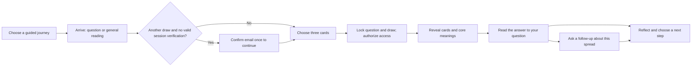

# Tarotova — extended UI/UX and product plan

Prepared 14 September 2026. **Proposed work, not implemented.** This extends
[PLAN.md](./PLAN.md) from the working 22-card application into a distinctive,
question-led tarot experience across phones, tablets and desktop.

For screen-by-screen journey layouts, a phone wireframe, exact data sources,
content publishing and the interpretation pipeline, see
[JOURNEY-DESIGN.md](./JOURNEY-DESIGN.md). The later access-policy revision in
[ACCESS-FLOW.md](./ACCESS-FLOW.md) specifies a first reading without email and
verification when starting another reading.

The user is handling deployment of the latency/OTP fixes separately. Their
live outcome remains tracked in [ISSUES.md](./ISSUES.md). This document does
not claim those issues are resolved in production.

## 1. Product direction and scope

**Make Tarotova feel like entering a quiet, mysterious observatory: bring a
question, choose three cards, uncover a perspective, and leave with something
useful to reflect on.** The atmosphere should be enigmatic; navigation,
loading states and errors should be clear.

**Confirmed priorities:** a question companion and guided journeys. The
signature experience is **Ask → Draw → Explore → Take a next step**. People
can bring their own question or choose a structured journey. Sections 13–14
define these two product pillars and explicitly defer the other ambitions.

The target experience supports a person's written question, an interpretation
that actually relates to it, and bounded follow-up questions about the same
reading. The user selected this direction on 14 September 2026. A question is
optional; a general reading remains one tap away. Guided journeys provide a
starting point when someone is unsure what to ask.

This extension supersedes the original plan's minimal visual treatment,
screens and no-free-text-question scope in sections 1–4. It extends sections
5, 7, 9 and 10 for contextual answers, interaction state, testing and delivery.
The existing server-owned shuffle, upright RWS meanings, locked draw,
reading ownership and server access checks remain the foundation. The selected
first-reading-without-email direction replaces mandatory OTP on every reading;
see `ACCESS-FLOW.md` for the required backend migration.

| Priority | Included |
| --- | --- |
| First redesign release | Complete visual system; polished existing journey; immediate card interaction; responsive layouts; accessible motion; useful loading and recovery states |
| Access-policy milestone | One guest reading, continuation verification before a second draw, remembered verification in the same browser and explicit per-reading access grants |
| Question-led release | Optional written question; contextual interpretation; suggested and typed follow-ups; generation recovery; privacy and spending controls |
| Guided-journey release | Three self-paced pilot journeys; clear steps and prompts; one existing three-card spread per run; same-browser progress and recovery |
| Future scope | Journaling/history, additional spreads, interactive card library/full 78-card expansion, accounts/sync, save/export, narration, themes and installable/native apps |

Native App Store/Play Store apps are a separate future decision. The first
target is an excellent responsive website in iOS and Android browsers, tablets,
desktop and resizable windows. No redesign milestone depends on commissioning
all 78 cards: ship a coherent 22-card deck, then expand without changing the UI
architecture. Display the actual deck size honestly.

## 2. What the current experience needs

| Current implementation | User impact | Planned change |
| --- | --- | --- |
| Homepage is mostly copy, chips and a button | Little visual identity or reason to explore | Art-led opening with a question composer and a small interactive card composition |
| Each card tap waits for its save; the whole deck becomes busy | Choosing cards feels like submitting a form repeatedly | Immediate local feedback and a serialized background save queue |
| Identical generic surfaces on every screen | The journey has little progression | Distinct intention, selection, verification and reveal compositions within one design system |
| Result is three small cards with similar text blocks | The important takeaway is difficult to find | Combined answer first, larger card art, progressive explanation and an actionable reflection |
| Focus categories only; overview joins predefined text | No understanding of a person's actual question | Contextual synthesis grounded in the fixed cards and reviewed meanings |
| Fixed bottom tray without a full device strategy | Keyboard, short-screen and safe-area friction | Form-factor layouts plus keyboard, zoom, rotation and safe-area testing |

## 3. Art direction: midnight observatory

Use a deep ink/plum stage for the opening and card ritual, warm parchment
surfaces for extended reading, restrained gold linework, and original symbolic
illustrations. A faint radial halo and a sparse engraved star map can create
depth. Keep decorative elements behind content with readable text surfaces.

The strongest visual investment should be the cards: recognizable symbolic
scenes, rich framing, coherent texture and intentional light. More gradients
alone will not solve the current basic appearance.

### Proposed visual tokens

These are starting design values; validate actual foreground/background and
interaction-state combinations before treating them as approved tokens.

| Role | Starting value / treatment |
| --- | --- |
| Night background | `#14111F` |
| Raised dark surface | `#211B30` |
| Primary text on dark | `#F5EBDD` |
| Secondary text on dark | `#C4B9D0` |
| Gold accent | `#D5B47A`; framing and selected-state detail |
| Quiet violet | `#AC9BCB`; decorative depth, not a default text color |
| Reading surface | `#F6F0E7` with `#30253B` text |
| Typography | Keep Fraunces for expressive titles and Inter for controls/body; tune scale and spacing before adding fonts |
| Type scale | Body 16–18px; display approximately 36–68px using fluid sizing; comfortable 55–70-character reading measure |
| Spacing | 4/8/12/16/24/32/48/64px; generous gaps around the reading itself |
| Shape | Fine card frames, moderately rounded panels, pill-shaped topic suggestions; distinct buttons rather than every element becoming a pill |

Prepare a finished card back and three representative face studies before
extending the art language across all 22 cards. Use The Star, The Tower and
The Fool to test hopeful, difficult and exploratory symbolism. The Tower must
remain readable and thoughtful without becoming threatening.

Public hero cards are clearly illustrative examples and have no relationship
to a visitor's private draw. The selected card identities only appear after the
server grants access to that reading. Maintain an asset provenance record and
responsive image sizes.

## 4. The proposed journey

Use a quiet progress indicator: **Your question → Your cards → Reveal**.
The first reading proceeds to reveal without email. For a subsequent draw, ask
for verification before card selection if the browser session is not already
verified. Explain the rule before the first reading; preserve the first result
when the continuation gate is dismissed. Follow-ups and guided steps on the same
reading are not new draws.

### A. Homepage and question composer

Hero copy direction:

> What is asking for your attention?
>
> Bring a question. Choose three cards. Find a perspective to sit with.

Place a real, visible textarea near the main action, with a persistent label
such as “Your question (optional)” and a 500-character limit. Example prompts
are editable shortcuts, not required categories:

- “What should I consider before changing jobs?”
- “How can I approach this conversation with more clarity?”
- “What pattern am I ready to change?”
- “What deserves my attention right now?”

Keep the existing topic chips as optional context. Selecting an example must
never overwrite a question the person has already typed without a clear action.
Primary action: **Choose my cards**. Secondary action: **Explore a general
reading**. Adjacent disclosure: “Your first reading needs no email. Confirm
your email to continue with more free readings.”

On phones, the question and action take priority over decorative art. On wider
screens, use an editorial two-column layout with a layered card composition.
Below the hero: a short three-step explanation, an example of the reading's
structure, and a concise note about the method. Use genuine product detail
rather than invented testimonials, reader counts or activity notifications.

Add a secondary **Explore guided journeys** entry with a small preview of the
three launch themes. Each preview explains its purpose and self-paced steps.
The free-form question remains the homepage's primary action.

### B. Card selection as a tactile ritual

Show the question in a compact summary with an Edit action until locking.
Present three clearly named positions: Situation, Challenge and Guidance.
Each selected card receives a number and joins the matching tray position.

Selection responds immediately: the card lifts slightly, its border changes,
and a small duplicate card back travels to the tray. Keep the original slot
footprint so surrounding cards do not jump. Support deselection until locking.
Show “Saving…” quietly when necessary, then “Saved”; never claim unsaved state
is durable. The primary action becomes **Reveal these cards**. Access eligibility is
checked before selection and rechecked atomically at lock, so conflicting tabs
can recover without granting a second free draw.

For selection itself, prefer a readable grid with carefully spaced cards. A
fan may appear in the hero or as a shuffle transition; overlapping cards must
not make touch targets hard to distinguish. Cards have equal visual weight
before selection—decoration must not imply one card is algorithmically special.

No gesture is required. Tap/click/keyboard selection is complete on its own;
swiping or dragging may be an optional enhancement. Shuffle is available only
with an empty selection; Clear selection is explicit and reversible before lock.

Render from server-provided slot count instead of the hardcoded `22`. For the
later 78-card deck, use stable pages of 26 opaque slots; paging preserves the
same shuffle, selection order and tray.

### C. Email and confirmation

For an unverified visitor beginning a second reading, show a focused “Keep
exploring” continuation form before card selection. Preserve the intended
question/journey and any existing draft. Forms should have legible labels and
one primary action. Keep the code input compatible with paste, autofill,
leading zeros and the numeric keyboard. Support browser Back without losing
the intended new question or access to the earlier reading.

Present the actual provider state: accepted, uncertain or failed. Show the
server's wait interval for rate limits. Email changes and resend requests preserve
the intended destination and use a fresh Turnstile token. Avoid repeated layout shifts
when the widget loads or an error appears. The composer and OTP input must
remain visible while the software keyboard is open.

### D. Reveal and reading

After authorization, display the three card faces in order. Offer a short
automatic reveal and an always-available **Show all** action. Reduced motion
shows the result immediately. Once revealed, refresh/back navigation must not
force the ceremony again.

The result has a deliberate reading hierarchy:

1. The person's question, or “A general reading.”
2. A concise combined takeaway, with the three cards visible.
3. Situation, Challenge and Guidance sections: artwork, meaning in this
   position, and relevance to the question.
4. One practical reflection or small next step.
5. **Ask about this reading**, with example follow-ups.

On phones, show a compact spread summary above vertically readable sections.
On desktop, pair a larger spread with a comfortable reading column. Avoid
squeezing long paragraphs into three narrow columns. Keep the card explanation
within the reading; a separate interactive symbolism library is future scope.

If contextual generation is slow, reveal the authorized cards and existing
editorial meanings first. Label the question-specific answer as being prepared;
never make a functioning card reading wait behind an AI spinner.

### E. Follow-up and reflection

Keep the same spread visible beside or above a small conversation panel.
Examples: “What might the challenge mean here?”, “What can I act on today?”,
and “How do these cards connect?” Also accept a typed follow-up.

Start with a visible limit of three follow-ups per reading, subject to measured
cost and quality. Explain the limit before submission. A follow-up clarifies
the existing draw; it does not silently draw new cards, alter the original
answer or require another email code within the existing access grant.

Later, offer an optional private reflection note and an explicit save/export
action. Begin with device-local notes and clearly state the device boundary.
Do not suggest a bookmark opens a private reading on another device. Any share
preview omits the original question, email and note by default; the user chooses
what to export. Do not introduce public reading URLs as a shortcut around access.

## 5. Making questions meaningful

The current deterministic overview does not interpret arbitrary text. Merely
echoing a question above that overview would be a cosmetic change. The target
question feature needs a contextual interpretation layer.

**Proposed approach:** retain reviewed card meanings as the source of truth,
then use a server-side language-model adapter to relate those meanings to the
question. Select the provider/model after testing answer quality, response
latency and per-reading cost; no vendor, subscription or spend is authorized
by this planning document.

The model receives only the question, explicit focus, fixed card IDs and
positions, curated meanings and bounded conversation history. It has no control
over shuffling, selection, verification or access. Treat question text as data,
not instructions that can override the system's interpretation constraints.
Render output as text or sanitized structured content, never arbitrary HTML.

Require a structured response: combined perspective, one explanation per known
card/position, one reflective action and suggested follow-ups. Validate the card
references and output shape. Save accepted output so refreshes do not generate
different answers. Distinguish the reviewed card meanings from AI-assisted
contextual reflection in a concise, discoverable explanation.

Illustrative behavior, not a generated reading: for “What should I consider
before changing jobs?", a spread containing The Fool, The Chariot and
The Hermit would connect exploration, direction and considered
reflection to the career question. It would not invent an offer, a date or an
employer's intentions. Production examples must use only cards available in
the deployed deck and clearly distinguish sample readings from a private draw.

Free-text questions can involve sensitive circumstances. Keep copy agency-led:
explore options and personal perspective, avoid certainty about future events
or other people's private thoughts, and do not present tarot as professional
diagnosis or a command to make consequential decisions. Define and evaluate
appropriate responses to distress before enabling open-ended follow-ups.

If the provider is unavailable, the fixed cards and editorial reading remain
available with a clear “Personalized reflection is unavailable” message and a
bounded retry. Do not label a generic fallback as an answer to the exact question.
An intention-only experience can serve an earlier prototype, but it does not
fulfill the selected question-companion scope.

## 6. Motion specification

Motion should explain interaction, create a moment of anticipation and settle.
Start with CSS transforms/opacity and a small isolated animation layer; add a
library only if the prototype demonstrates a need within the bundle budget.

| Moment | Proposed motion | Duration target | Reduced-motion behavior |
| --- | --- | --- | --- |
| Initial hero | Card composition fades into its final position once | 350–500ms | Final composition immediately |
| Focus/hover | Fine border emphasis; subtle lift only on hover-capable pointers | 120–160ms | Border change |
| Card selection | Lift and movement of a card-back duplicate to its numbered tray slot | 180–260ms | Selection state and number change immediately |
| Shuffle | Small stack compression and redistribution while the request runs | 450–650ms maximum visual sequence | Clear busy state, no spatial motion |
| Route transition | Short fade between stable content frames | 140–200ms | Immediate transition |
| Reveal | Three staggered flips/fades after authorization, skippable | Total 700–1,000ms maximum | All faces and text immediately |
| Follow-up answer | Stable answer area; no forced typewriter effect | Content appears as ready | Same readable content |

These durations are design targets, not minimum waits. A completed request
does not wait for a theatrical timer. A slower request gets a real loading
state after the animation settles. Failed shuffles preserve the acknowledged
deck; they do not visually imply a completed reshuffle.

Avoid permanent particle fields, scroll hijacking, autoplay sound and continuous
large blur/filter animations. A static star map and controlled light are enough
to create atmosphere. Optional sound can be explored later with explicit opt-in;
haptics must never be required for feedback.

## 7. Responsive and accessible by design

Use content-driven CSS layouts, not device-name detection. The ranges below
are starting layout bands; confirm them with real content and testing.

| Viewport width | Composition and behavior |
| --- | --- |
| 320–374px | Single column, compact heading, three deck columns if needed for usable targets; tray/CTA may stack |
| 375–599px | Four deck columns where they fit; question first; bottom tray with safe-area padding; vertically readable result |
| 600–899px | Four to six deck columns; centered forms; wider spread summary; adapt to tablet split view and large text |
| 900–1199px | Two-column intention layout; deck with a side or bottom tray depending on height; artwork beside interpretation |
| 1200px+ | Restrained maximum width around 1,200–1,280px; spacious composition, six to eight deck columns; keep reading text narrow enough |

Support short landscape windows as carefully as tall portrait screens. Reserve
real document space for any sticky controls; no card, error or footer link may
sit behind them. Use safe-area insets and modern viewport sizing progressively,
and test the actual keyboard interaction—`100dvh` alone is not a keyboard fix.
[WebKit's safe-area guidance](https://webkit.org/blog/7929/designing-websites-for-iphone-x/)
and [viewport-unit explanation](https://webkit.org/blog/12445/new-webkit-features-in-safari-15-4/)
inform this implementation.

Target WCAG 2.2 AA, with reduced motion supported as an additional product
requirement. Keep controls at least 44×44 CSS px as a product target; this is
stricter than the standard's 24px minimum target-size criterion with exceptions.
Provide keyboard operation, visible unobscured focus, labeled inputs, contrast
checks and screen-reader announcements for selection, saves and errors. Maintain
reflow at 320 CSS px and usable enlarged text. Cards announce position and
selection order without disclosing hidden identities. These criteria require
manual checks as well as automated scans. See [WCAG 2.2](https://www.w3.org/TR/WCAG22/).

Device coverage for each release:

- iPhone Safari: compact and large viewport, portrait/landscape, keyboard open,
  browser bars expanding/collapsing, VoiceOver and larger text.
- Android Chrome: budget/midrange physical phone plus larger viewport, TalkBack,
  keyboard open and a constrained network. Include Samsung Internet smoke tests.
- iPad Safari and an Android tablet: both orientations, split-screen/narrow
  window and touch plus keyboard/pointer where available.
- Desktop Safari, Chromium and Firefox: keyboard-only, zoom and narrow-to-wide
  resizing. Include a foldable-sized narrow/wide resize in automated coverage.

Maintain a latest-and-previous-major browser test policy and record the actual
versions at release time. Emulator screenshots complement physical-device
testing; they do not prove iOS keyboard or Android performance behavior.

## 8. Performance and interaction engineering

The redesign must improve responsiveness instead of disguising slow requests
with animation. Proposed budgets below are release targets, not measurements.

| Measure | Target and measurement |
| --- | --- |
| LCP | ≤2.5s at p75 of real page loads, segmented by mobile/desktop |
| INP | ≤200ms at p75 of real interactions |
| CLS | ≤0.1 at p75; reserve dimensions for art, widget and loading content |
| Card-tap feedback | Visible local state within 100ms on the reference midrange phone |
| Warm create/save/lock/status API | Aim for p95 ≤800ms from a defined Asia test location; report cold starts separately and measure other geographies |
| Incremental redesign JavaScript | ≤40KB compressed per initial route beyond the measured current framework/app baseline |
| Hero/card-back visual payload | Aim for ≤200KB compressed initially; lazy-load noncritical art and authorized result faces |
| Personalized answer | Aim for first useful content ≤3s, bounded 15s attempt; independent of base card reveal; revise after provider benchmarking |

The Core Web Vitals thresholds above follow
[web.dev's definitions](https://web.dev/articles/defining-core-web-vitals-thresholds).
The API, asset and contextual-answer budgets are proposed project goals.

Implementation work:

1. Establish the post-deployment region/OTP baseline before attributing gains
   to design changes. Keep private database work near Supabase.
2. Make homepage creation accept initial focus/question in one validated
   request, removing its current follow-up focus mutation and ignored error.
3. Separate visible selection state from acknowledged server state. Allow
   immediate taps, serialize saves and coalesce queued edits to the latest
   desired selection. Each save uses the latest acknowledged revision.
4. Enforce revisions with a conditional database update, not only a pre-read
   comparison. The server must reject stale saves even under concurrent tabs.
5. Lock only the final acknowledged selection, with a clear “Saving your
   choices…” state while flushing outstanding edits. On conflicts or network
   loss, show recovery and preserve the user's intent; never silently claim
   that local-only edits were saved.
6. Reduce unnecessary status/result waterfalls through authorized server
   rendering or a consolidated bootstrap response. Do not expose a private
   result in HTML, client prefetch or shared caches before authorization.
7. Keep decorative hero content server-renderable. Hydrate the composer/deck
   as focused client components; load follow-up functionality on demand.
8. Reuse card-back assets, set image dimensions, prioritize only the first
   meaningful visual and avoid loading all card faces for a hidden deck.
9. Keep the existing fonts initially. Profile animations on real hardware;
   prefer transform/opacity and reduce effects when the browser cannot sustain
   smooth interaction. A slow-device mode can use the same reduced effects.

## 9. Question data, API and generation lifecycle

The detailed [experience and data specification](./JOURNEY-DESIGN.md) maps each
screen to its inputs and distinguishes existing draft content from required
templates, review records, migrations and model integration.

The visual redesign needs no new accounts. Personalized questions are a
separate feature with a migration, a provider adapter and explicit retention.

| Area | Proposed addition |
| --- | --- |
| Reading context | Optional question and explicit focus; editable only in draft; frozen together with the draw at lock |
| Generation record | Reading ID, context version, status, idempotency key, model/prompt/content versions, validated output and timestamps |
| Follow-ups | Ordered per-reading turns, bounded text/history and token budget; independent status/retry for each submission |
| Initial API | Extend `POST /api/readings` with optional context; keep an empty-body general-reading path compatible |
| Editing | Add an owned, revision-checked draft context update or extend the existing mutation contract; preserve stable slot IDs |
| Contextual answer | Authorized, idempotent `POST /api/readings/[id]/interpretation`; repeat calls return the stored/pending generation |
| Follow-up API | Authorized `POST /api/readings/[id]/followups`; client submission ID deduplicates double-taps and retries |
| Recovery | Owned read endpoint reports generation/turn state; refresh retrieves the same accepted answer |

The editorial result remains frozen at lock. Contextual synthesis begins only
after a guest or verified-session reading grant is issued and has its own
stored output/version. The server atomically
claims a generation with a lease and attempt count; a bounded request awaits
the provider and commits the result. A disconnected client must not trigger
duplicate paid work. A later authorized retry can recover an expired lease.
If this cannot fit measured runtime limits, use an explicit durable job runner;
never depend on unfinished serverless work continuing after the response.

Do not send email addresses, session tokens or unrelated reading history to the
model. Explain that typed questions are processed to personalize the reading.
Exclude questions, notes and answers from analytics, URLs, browser error
telemetry and ordinary runtime logs. Set text-length/output limits on the server
and enforce per-reading, per-session and global spending bounds. Measure cost
per completed reading before setting the public follow-up allowance.

Proposed retention: abandoned question drafts expire with the 24-hour draft;
question/contextual answers/follow-ups expire with reading access, at most 30
days, for both guest and verified-session grants. Build and test the deletion job before persisting this text in production;
the current code's read-time expiry is not deletion. Keep notes device-local
unless the user explicitly asks to save them to a future account. Provider-side
data retention is a separate selection criterion and must match the published
privacy explanation.

## 10. Failure and recovery design

| Situation | Required experience |
| --- | --- |
| Slow or failed draft save | Immediate local feedback plus honest unsaved state; retry; Continue waits for acknowledged choices |
| Stale revision / another tab | Explain that the reading changed, reconcile with server state, let the user reapply editable intent |
| Shuffle failure | Preserve previous mapping and selection state; enable retry without pretending a new deck was saved |
| Offline during drawing | Preserve in-page intent, show offline state, disable server-dependent lock/reveal; resync when connectivity returns |
| Rate-limited OTP | Show server wait; maintain question and cards; no forced restart |
| Uncertain OTP delivery | Preserve a usable code, explain uncertainty and provide the controlled resend path |
| Wrong/expired code | Inline correction/retry route; maintain draw; announce error without moving focus unpredictably |
| Personalized answer timeout | Cards and curated text remain readable; a single bounded retry for the same generation |
| Follow-up failure | Retain the typed question and earlier answers; retry with the same submission ID |
| Expired reading / wrong browser | Clear explanation of availability; offer a new reading without implying it recreates the old draw |
| Reduced motion / assistive technology | Same complete journey and outcomes without spatial animation or gesture requirements |

## 11. Build sequence and concrete deliverables

Work in reviewable milestones. Effort ranges are planning estimates for one
developer/designer using the existing app, excluding commissioned artwork,
external review and account-provisioning delays; they are not calendar promises.

| Milestone | Deliverable and exit condition | Estimate |
| --- | --- | --- |
| 0. Live baseline | User deploys current fixes; record actual region, API timings and one completed OTP journey | Measurement task after deployment |
| 1. Design prototype | Finished home, choose and conversational result; journey chooser and a guided step at 390px and 1440px; tablet layout; tokens; card-back/face studies; reduced motion | 3–4 days |
| 2. Responsive foundation | Shared shell, surfaces, typography, form states and safe-area layout; existing flow works at 320px through desktop | 2–3 days |
| 3. Fast deck and reveal | Save queue plus atomic revision checks, immediate selection, lock/recovery tests, staged reveal and complete email states | 3–5 days |
| 3a. Guest and continuation access | Atomic guest allowance/grants, session-scoped OTP, second-reading gate, remembered verification, legacy migration and recovery tests | 3–5 days |
| 4. Question-led reading | Context schema, question UI, model evaluation/adapter, frozen synthesis, cleanup, explicit failure fallback and contextual result layout | 4–6 days |
| 5. Follow-up conversation | Three-turn initial allowance, same-spread grounding, idempotent retries, history recovery and spending controls | 2–4 days |
| 6. Guided journeys | Three reviewed journey templates, owned runs, step completion/resume, shared question-companion flow and no extra draw required per step | 3–5 days |
| 7. Device and launch review | Browser automation, accessibility/manual-device checks, performance profiling, staged rollout and visual polish across both product pillars | 2–3 days |

Milestones 1–3 form a useful visual release while contextual answers are
developed. Show a question composer publicly as personalized interpretation only
when milestone 4 works; earlier versions may offer an explicitly private
intention. Release the conversation only after milestone 5 passes its checks.
The no-email first-reading promise requires milestone 3a; do not advertise it
with a client-only gate change. Guided journeys are the next product milestone, not a journal/account
dependency. Release them after milestone 6 passes its checks.

Implementation map:

| Existing area | Planned work |
| --- | --- |
| `src/app/globals.css`, `src/app/layout.tsx` | Tokens, responsive shell, type scale, themes and focus/motion behavior |
| `src/app/page.tsx` | Editorial hero, optional question, examples, atomic reading creation |
| `src/components/CardBackSlot.tsx`, choose page | Accessible card states, selection queue, tray, responsive deck and save recovery |
| Email/confirm pages and session verification API | Second-reading continuation gate, preserved destination, form/keyboard polish and complete OTP states |
| Result page | Reveal, spread summary, question-specific answer and readable card details |
| `src/server/readingService.ts`, DB schema/API | Atomic revision enforcement, context lock and private result bootstrap |
| New interpretation service and tests | Provider abstraction, validated synthesis, idempotency, turn limits and recovery |
| New journey content, owned runs and routes | Versioned three-step templates, journey chooser, run progress/resume and companion integration |
| New shared UI components | QuestionComposer, ReadingProgress, SelectionTray, CardReveal, ReadingSection, FollowUpPanel, JourneyPicker and JourneyStep |

After implementation, update `IMPLEMENTATION.md` with what actually shipped;
do not mark planned question/chat features as present merely because their UI
mockup exists.

## 12. Acceptance criteria and rollout

The first redesigned release is complete when all existing reading and access
tests still pass, every step has a deliberate responsive composition, selection
feels immediate on the reference Android device, and errors preserve progress.
No app-wide animation or new dependency is accepted without a measured benefit.

Required regression scenarios include rapid select/deselect during slow saves,
Continue during a pending save, two conflicting tabs, shuffle/retry, reload at
every step, keyboard-open forms, actual iOS OTP autofill, reduced-motion reveal,
wrong code, delayed email, provider failure and access expiry. Test with 22
slots and a 78-slot fixture even before the full deck is released.

For the question release, evaluate a fixed set of at least 30 questions spanning
the four focuses, ambiguous wording, long input and sensitive topics. The
answer must relate to the actual question and reference only the selected cards;
follow-ups preserve that spread. Include outages, duplicate submissions,
generation timeout/recovery, output validation and deletion tests. Have a human
review the interpretive tone and difficult-card examples before enabling it
widely. No cross-user context or result leakage before a valid reading grant
is acceptable; guest grants intentionally allow the first result without email.

For guided journeys, verify step order, optional skips, refresh/back/resume,
expired access, wrong-browser denial, duplicate completion and template version
stability. Every template must work with the existing 22-card deck and three-card
spread. Finishing a journey must not require journaling, an additional draw or
more follow-ups than the shared reading allowance. Test each complete journey
on phone and tablet layouts as well as desktop.

Use preview deployments for visual/device review. Keep contextual generation
behind a server-controlled feature flag with a working editorial fallback;
rollback must preserve existing readings and saved outputs. Migrations should
be additive and compatible with the currently deployed UI.

Measure the first-reading funnel: start → cards selected → result viewed →
reflection/follow-up used. Measure second-reading intent → continuation
verification → next result separately. Track stage latency,
save failures, send failures and abandonment by broad device class. Do not
collect question text or email in these events. Set improvement targets after
the live baseline; do not invent conversion goals or promise a retention lift.

The next implementation task is **milestone 1: a polished, responsive prototype
of the home, card-selection and conversational result screens**, plus the
guided-journey chooser and a complete guided step. Establish the visual language
before carrying it through the rest of the product.

## 13. Selected product pillars

Scope decision, 14 September 2026: the user selected **A question companion**
and **Guided journeys**. The other ambitions are retained in section 14 as
future scope. The existing three-card spread and 22-card deck support both
selected pillars. The newer guest/continuation access design applies to both.

### A. A question companion

The promise: **“Bring what is on your mind. Explore it through your cards.”**

A person types a question, optionally refines it with one short clarification,
and draws their cards. Their interpretation relates the fixed spread to that
question. They can ask suggested or typed follow-ups, then leave with a useful
perspective or a small next step.

For example, “Why do I keep putting off a career change?” can lead to a reading
about exploration, direction and reflection, followed by “What could I try this
week?” The answer should stay grounded in the actual cards and the person's
words. It does not require a journal, persistent profile or earlier readings.

Requirements:

- Offer at most one optional clarification before drawing; always allow Skip.
  The person approves any rewritten question before it replaces their wording.
- Keep the original question and fixed cards visible throughout the answer and
  follow-ups. Explain when a question goes beyond what this spread can support.
- Start with the shared three-follow-up allowance from section 4. The exact
  allowance remains subject to cost and quality testing; show it before use.
- End with a clear takeaway and a natural stopping point. No saved note or new
  draw is necessary to finish.
- Implement the contextual generation, authorization, retry, deletion and
  spending requirements in sections 5 and 9. Cross-reading memory is deferred.

### B. Guided journeys

The promise: **“If you are unsure where to begin, take it one step at a time.”**

Launch three editorially designed, self-paced journeys. Each uses the existing
Situation / Challenge / Guidance spread once; subsequent steps explore that
same reading. A journey can be completed in one visit or resumed in the same
browser while its run and reading remain available.

| Pilot journey | Frame the question | Explore the spread | Choose a next step |
| --- | --- | --- | --- |
| Navigating a change | “What feels uncertain about this transition?” | Connect the situation, tension and guidance to that change | Identify one small action within the person's control |
| Preparing for a conversation | “What would you like to communicate more clearly?” | Explore the person's perspective, assumptions and approach | Choose one point to express or question to ask |
| Reopening creativity | “Where do you feel stuck or hesitant?” | Consider the block and a possible way forward | Choose a small creative experiment |

**Entry and navigation.** Add a journey chooser at `/journeys` and public
preview pages at `/journeys/[slug]`. Show the purpose, all three stages and the
first-reading/continuation verification disclosure before starting. Private progress lives in an
owned run at `/journey/[id]`, linked to the ordinary reading flow. Each step
has a heading, brief prompt, clear primary action and Back navigation. Preserve
the selected journey when moving through card selection and verification.

**Question and draw.** Stage one offers an editable question starter and the
same optional clarification as the question companion. The person locks that
question with their three-card draw. Stage two presents the contextual answer
and journey-specific suggested follow-ups. Stage three presents a concise
reflection or next-step prompt; responding in writing is optional. Stage three
can finish without any additional model call or private note storage.

**Completion and pace.** Allow optional reflection prompts to be skipped. Show
progress as stages, not days or streaks. There are no forced waiting periods,
reminders, extra draws or repeated code verification for the same valid reading.
A user can exit naturally and resume an active run without being penalized.

**Minimal persistence.** Store a journey run's ID, owning browser-session ID,
template slug/version, reading ID, current step, revision, completion state and
expiry. Keep question text in the reading's existing context; do not duplicate
it into a journal. Freeze the template version at start so published content
changes cannot rearrange an active run. Update progress with authorization and
revision/idempotency checks so refresh or double-taps do not advance twice.

An abandoned unauthorized run expires with its draft; an authorized run expires
no later than the reading's access. The cleanup job must remove expired runs.
A wrong browser cannot recover a run from its URL alone. Returning users may
see **Continue your journey** for an active owned run; this is a resume shortcut,
not a searchable reading history. If access has expired, explain it and offer a
new journey rather than silently replacing the original draw.

**Shared generation budget.** Journeys reuse the reading's interpretation and
follow-up allowance. Templates themselves are reviewed content, not generated
on every page view. Do not spend an additional paid generation merely to advance
a step or pretend to personalize a static prompt. General editorial guidance
remains usable when contextual generation is unavailable.

**Content and acceptance.** Review each pilot for clear prompts, supportive
wording and an attainable ending. Journeys must work without user-history
analysis, alternative spreads, narrated audio or full account creation. Apply
the same guest-first and second-draw continuation policy as standalone readings. Assess whether people can complete a journey and
identify a useful next step; keep question text out of completion analytics.

## 14. Future scope and delivery order

The following ideas are retained for later consideration and are not required
for the question companion or guided journeys:

| Future idea | Deferred work |
| --- | --- |
| Living journal and history | Saved reflections, reading threads, past-entry summaries, export and longer retention |
| Additional reading formats | One-card/five-card spreads, choice exploration and custom spread design |
| A world inside the cards | Interactive symbolism hotspots, a standalone learning library and full 78-card expansion |
| Accounts and synchronization | Cross-device saves, recovery and selected-history personalization |
| Richer sensory features | Narrated readings, voice input, ambience, collectible themes and time-of-day variants |
| Distribution enhancements | Installable web app, native apps and deliberate sharing features |

The original visual ambition remains current: attractive card art, rich but
readable surfaces, elegant motion, responsive layouts and fast feedback. An
interactive card-learning product is separate from making the current deck
visually appealing. The user subsequently selected a first reading without
email; the continuation gate and its access migration are now in scope under
`ACCESS-FLOW.md`. Cross-device accounts and saved history remain deferred.

Delivery order:

1. Prototype and implement the visual, responsive and performance foundation,
   including the first-reading and second-reading continuation experiences.
2. Implement the server access-policy migration, then deliver the question
   companion, including meaningful contextual answers and
   follow-ups with reliable recovery.
3. Deliver the three guided journeys using that same companion and reading flow.
4. Validate both end-to-end across phone, tablet and desktop before widening scope.

The milestone estimates in section 11 now include a separate guided-journey
milestone. Future features above require their own decisions and estimates.
The next prototype should demonstrate **asking a personal question** and
**completing one guided journey**, rather than a journal or cross-device history.
